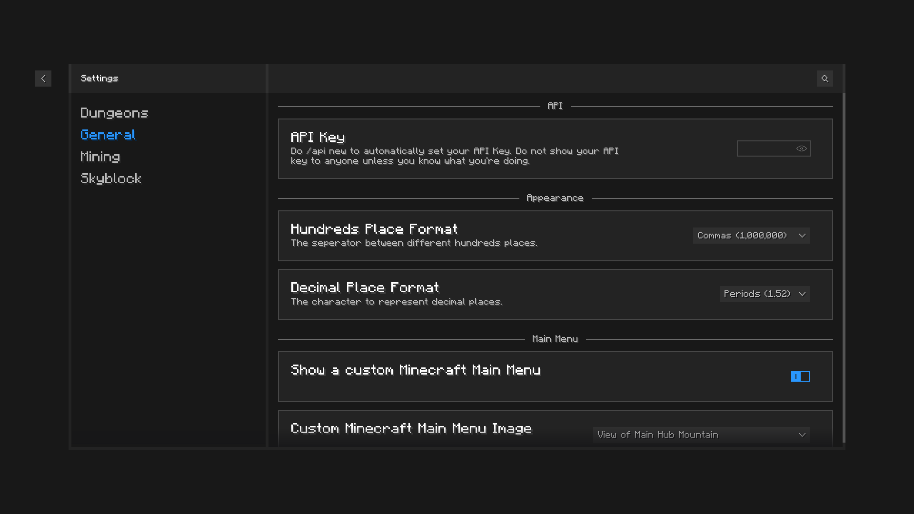
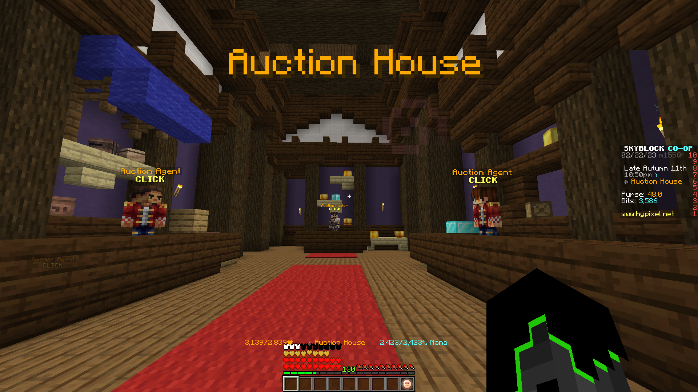
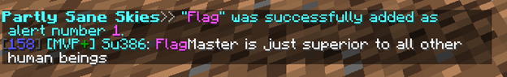
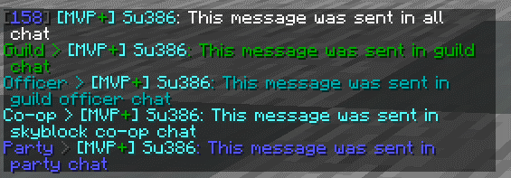
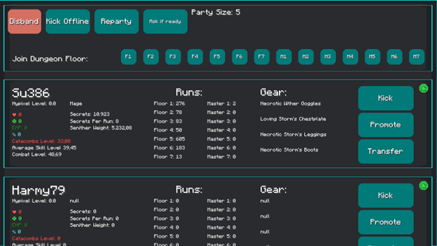
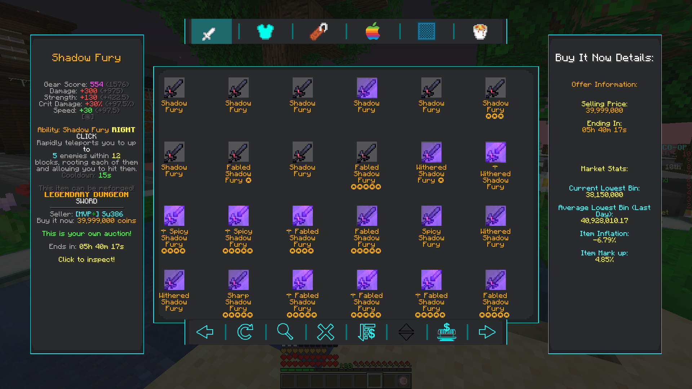

# **Partly Sane Studios Presents:** *Partly Sane Skies!*

  
  
  

## About

Latest Version: **Prealpha 0.0.9**

This is a Minecraft mod for Hypixel Skyblock, designed, built, and programmed by **Su386** and **FlagMaster (FlagHater)**

### Download

[Click here to go to the releases page](<https://github.com/Su386yt/partly-sane-skies/releases>).
 Open the assets drop down for the latest version and download "partly-sane-skies" .jar file.

### Discord

[Click here to join the discord](https://discord.gg/v4PU3WeH7z) for help, support, giveaways, and updates as they happen.

  
 Commands 

## Commands'

``/pss``: A help command for Partly Sane Skies
``/pss config``, ``/pssconfig``: A command to open the PSS Config menu. It can also be keybinded in the vanilla options menu. Default: ``F7``

``/pssdisc``, ``/pssdiscord``: Sends a link to the discord. [Or you can just join here (https://discord.gg/v4PU3WeH7z)](https://discord.gg/v4PU3WeH7z)

``/skillup <username>``, ``/su <username>``: Command to use the skill upgrade recommandation feature. (See Features)

``/pm``, ``/partymanager``: Command to open the Party Manager. It can also be keybinded in the vanilla options menu.

``/permparty``, ``/permp``, ``/pp``: Command to use Permanent Dungeon Party Selector. (See Features)

``/fp``, ``/pf``: Command to use Party All Friends. (See Features)

``/chatalert``, ``/ca``: Command to use the chat alerts system. (See Features)

## Features

(Click the drop down arrows to see more)

  
 <b> Everything is in this list can be configured in the config menu. Command:  <code> /pss config </code> Default Keybind:  <code> F7 </code>. The config menu can also be accessed through the custom skyblock main menu. </b> 

  

 

  
 General/Miscellaneous Features 

  
## General/Miscellaneous Features

General and miscellaneous features.

### Custom Main Menu

Upon start up of Minecraft, a nice, Skyblock themed main menu will display. There are various configurable options from Skyblock-themed backrounds, along with an option to select a random background.

### Skill Upgrade Recommendation

A helpful command to help recommend what skill you should upgrade less. Using ``/skillup <username>`` or ``/su <username>`` will provide a list of recommended skills to upgrade.

### RNG Drop Banner and Sound

When you get a rare drop, a Pumpkin Dicer or Melon Slicer like pop-up banner will appear, along with a sound, celebrating your drop.

### Worm Warning

When you are mining in the crystal hollows and a worm or scatha spawns, you get a message on screen, along with a sound, warning you that a worm has spawned.

### Location Banner

When switching to a new location region on skyblock, an MMO RPG style banner will appear, informing you that you have switched to a new region.

### Chat Alerts

Using ``/ca``, you can add and remove specific phrases that will be highlighted when someone says them. Example: If you add the word "``flag``" (using ``/ca add flag``) to the chat alerts, it will highlight the word and play a notification when someone says it.

### Chat Color

Private messages and messages that are sent in the Party, Guild, Guild Officer, or Skyblock Co-op channels will now have the color of the channel they are sent in.

### Incorrect Pet for Minion Alert

Warns you if you don't have the right pet for leveling up the minions, that way you never lose any pet EXP because you still have your level 100 dungeon pet activated.

### Non Chat Color

Messages sent by nons (non ranked players) can be configured to have the same white as the rest of the chat. This option is off by default but can be turned on.

  
 Dungeons Features 

## Dungeon Features

### Party Manager

Manage your party and join dungeons with a helpful party manager, with features such as viewing stats, kicking, party transfer buttons, and etc. Included in the Party Manager GUI. You can open it by typing the command ``/pm`` or by using the keybind. Default: ``M``

### Watcher Ready, Message, Warning, Siren and Sound

When the watcher is done spawning mobs, a message will appear on your screen, along with an optional sound, party message and World War II (1938-1945) air raid siren incase the previous two don't get your attention..

### Permanent Dungeon Party Selector

Automatically parties everyone in a permanent dungeon party. Using ``/pp`` or ``/permparty``, you have the option to create, party, delete, and add and remove members from your permanent party. You can even add different parties such as an f6Party or a jujuNonCarry party.

  
 Economy Features 

## Economy

### No Cookie Warning

Never lose your coins to the void again! When the mod detects you do not have a cookie active, it will warn you to buy a new one. Optionally, it can warn you only if you have a lot of coins in your purse.

### Enhanced Auction Menu and BIN Sniper

A brand new auction house menu that gives you more information on prices, instant inflation, and mark up. Using that information, the menu highlights BIN items that are significantly below their  value (Default: 13% below).

### Garden Shop Trade Cost

Shows you information about the garden shop trades.

  
 Shortcuts 

## Shortcuts

### Open Wiki Keybind

Using the keybind, it will automatically look up the wiki article for the item you are hovering over. (``NONE`` key by default)

### Pets Menu Keybind

A keybind shortcut to open the pets menu. Customisable in the vanilla options menu. (``NONE`` key by default)

### Crafting Table Menu Keybind

A keybind shortcut to open the crafting table menu. Customisable in the vanilla options menu. (``NONE`` key by default)

### Wardrobe Menu Keybind

A keybind shortcut to open the wardrobe menu. Customisable in the vanilla options menu. (``NONE`` key by default)

### Storage Menu Keybind

A keybind shortcut to open the storage menu. Customisable in the vanilla options menu. (``NONE`` key by default)

### Party All Friends

A command to party all of your active friends. Using ``/fp``, it will party every online member on your friends list.

