<h1> <a href="#----">  </a> </h1>

[//]: # (<h1 align="center"> Partly Sane Skies </h1>)
<h4 align="center"> <sup> A Quality of Life SkyBlock Mod</sup> </h4>

<p align="center">
  <a href="https://github.com/PartlySaneStudios/partly-sane-skies/releases" target="_blank">
    
  </a>
  <a href="https://github.com/PartlySaneStudios/partly-sane-skies/releases" target="_blank">
    
  </a>
  <a href="https://modrinth.com/mod/partly-sane-skies" target="_blank">
    
  </a>
  <a href="https://discord.gg/v4PU3WeH7z" target="_blank">
    
  </a>
</p>

## About

Partly Sane Skies is a Minecraft mod for Hypixel SkyBlock, designed, built, and programmed by **Su386** and **FlagMaster**. 

 >📋 - Credits including third party programs can be [found here](CREDITS.md)
 
 >📝 - Previous changelogs can be [found here](docs/pages/changelogs/previous_changelogs.md)

 >❓ - If you have any questions, please check the [FAQ](docs/pages/faq.md) before asking in the Discord.

 >🗃️ - Some other really cool mods can be [found here](https://sbmw.ca/mod-lists/skyblock-mod-list/)

### <a href="https://discord.gg/v4PU3WeH7z"></a> <sup>Discord</span></sup>
[Click here to join the Discord](https://discord.gg/v4PU3WeH7z) for help, support, giveaways, and updates as they happen.

## Download:
### Official Download Links: 

<a href="https://modrinth.com/mod/partly-sane-skies">
    
    <span style="font-size:larger;"><sup>Modrinth: Download "Featured Version" on sidebar</sup></span>
</a>
<br>
<a href="https://github.com/PartlySaneStudios/partly-sane-skies/releases">
    
    <span style="font-size:larger;"><sup>Github: Open the asset drop down for the latest version and download "partly-sane-skies".jar file.</sup></span>
</a>

Place that mod in the mods folder of your Minecraft and you are good to go!

*There is no "reborn" or "revamped" version of Partly Sane Skies. If you do find one, please report it in the [Discord](https://discord.gg/v4PU3WeH7z).*

## Usage:

*Click the arrows to toggle the full list of information*

<details>
  <summary> <b> ⌨️ Commands </b> </summary>

[``/pss``:](docs/pages/commands.md#pss) A help command for Partly Sane Skies

[``/pss config``, ``/pssconfig``:](docs/pages/commands.md#pssconfig) A command to open the PSS Config menu. The keybinding can also be changed in the vanilla options' menu. Default: ``F7``

[``/pssdisc``, ``/pssdiscord``:](docs/pages/commands.md#pssdiscord) Sends a link to the discord. [Or you can just join here (https://discord.gg/v4PU3WeH7z)](https://discord.gg/v4PU3WeH7z)

[``/skillup <username>``, ``/su <username>``:](docs/pages/commands.md#skillup) Command to use the skill upgrade recommendation feature. (See Features)

[``/pm``, ``/partymanager``:](docs/pages/commands.md#partymanager) Command to open the Party Manager. The keybinding can also be changed in the vanilla options' menu.

[``/permparty``, ``/permp``, ``/pp``:](docs/pages/commands.md#permparty) Command to use Permanent Dungeon Party Selector. (See Features)

[``/fp``, ``/pf``:](docs/pages/commands.md#friendparty) Command to use Party All Friends. (See Features)

[``/chatalert``, ``/ca``, ``/chal``:](docs/pages/commands.md#chatalerts) Command to use the Chat Alerts System. (See Features)

[``//farmnotifier``, ``//fn``, ``//farmnotif``:](docs/pages/commands.md#farmnotifier) Command to use the farm notifier system.

[``/wordeditor``, ``/wordedit``, ``/wr``, ``/wordreplace``, ``/wr``:](docs/pages/commands.md#wordeditor) Command to replace a word in the chat with another word or a phrase.

</details>

To view more information about commands, including how to use them, **[click here to visit the command page.](docs/pages/commands.md)**

<details>
  <summary> <b> 🛠️Config</b> </summary>

  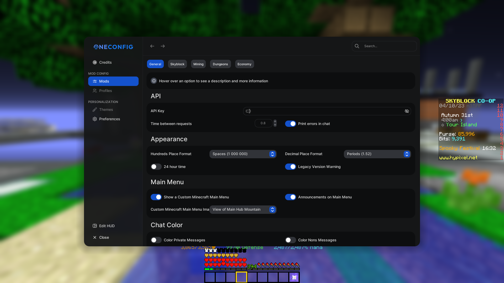

</details>

***Almost all features can be enabled and modified through the config menu.***

- Config Menu Command:  <code>/pss config</code> 

- Default Config Keybinding:  <code>F7</code>.

- The config menu can also be accessed through the [custom main menu, with the 'options' button.](docs/pages/features/general/custom_main_menu.md)

## Top Features:

***Note: the features below are just a small selection of all PSS features: these are just some of the more popular/liked features.***

*To view the complete list of all features, **[click here to visit the complete features page.](docs/pages/features/list.md)***
<details>
  <summary> ⚙️ General/Miscellaneous Features </summary>
  
## ⚙️ General/Miscellaneous Features

General and Miscellaneous features.

### Mods Checker
When enabled, Mod Checker automatically checks your mod list for outdated, suspicious, or unknown mods. These mods may not be on the list of verified mods.
If you believe a mod is being falsely flagged, please report it in the PSS discord (/pssdiscord)


### Privacy Mode
When enabled, Privacy Mode blocks other mods wanting to send data to their servers. Currently supported mods are Essentials & Dungeon Guide. If you know more mods that send that kind of data, feel free to report that in our discord server. ```/pssdiscord```


### Custom Main Menu

*For more information, [see the Custom Main Menu page](docs/pages/features/general/custom_main_menu.md)*

Upon start up of Minecraft, a nice, SkyBlock themed main menu will display.
There are various configurable options from SkyBlock-themed backgrounds,
along with an option to select a random background.

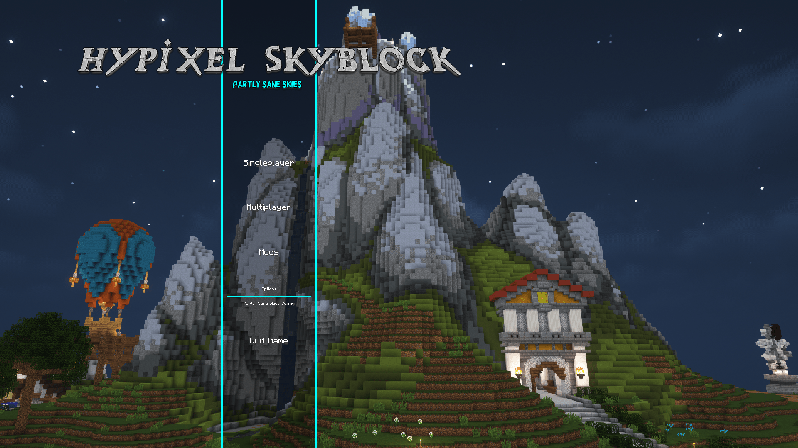 

### RNG Drop Banner and Sound

When you get a rare drop, a Pumpkin Dicer or Melon Slicer like pop-up banner will appear, along with a sound, celebrating your drop.

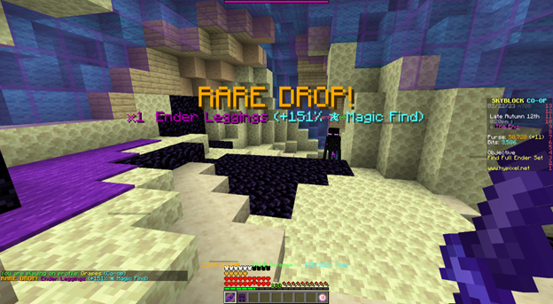 

### Custom Themes

This mod supports a variety of different themes, including dark themes, very dark themes, colorful themes, and controversially, light themes. You can also choose your own accent color, and create your own themes in the OneConfig menu under the theme section.

### Custom Sounds for SkyBlock

Instead of the normal note blocks, there is now the option to use computer generated, discord sounds or even live instruments to play sounds such as SkyBlock music and sound effects.

### Location Banner

When switching to a new location region on SkyBlock, an MMO RPG style banner will appear, informing you that you have switched to a new region.

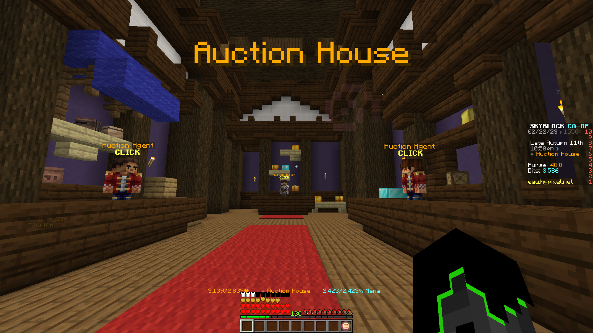 

</details>

<details>
  <summary> 💬 Chat Features </summary>

### 💬 Chat Alerts

Using ``/ca``, you can add and remove specific phrases that will be highlighted when someone says them. Example: If you add the word "``flag``" (using ``/ca add flag``) to Chat Alerts, it will highlight the word and play a notification when someone says it.

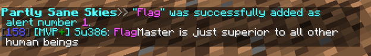

### Chat Color

Private messages and messages that are sent in the Party, Guild, Guild Officer, or SkyBlock Co-op channels will now have the color of the channel they are sent in.

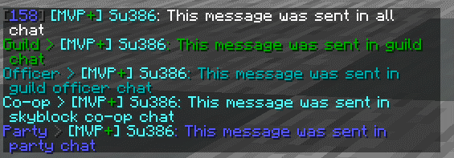

### OwO Wanguage

This feature basically changes all chat messages to use the owo language. Please don't use this; it literally breaks the chat completely. If you do, be warned.

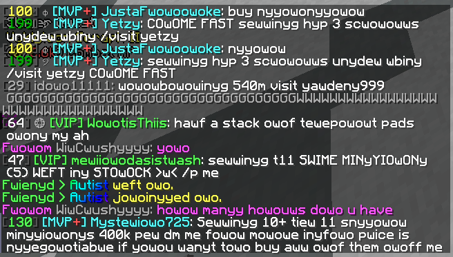 

### Pet for Minion Information Display

When opening the minion, your current pet selected will appear, along with the pet that you have set as favorite.

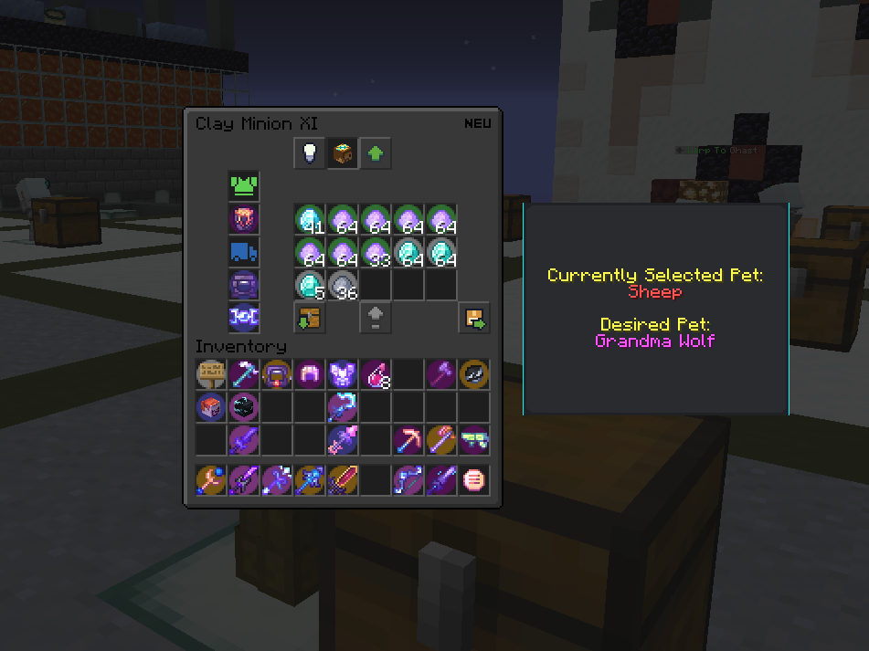 

### Nons Chat Color

Messages sent by nons (non-ranked players) can be configured to have the same white as the rest of the chat.
This option is off by default but can be turned on in the PSS Config menu.

### Word Editor for in game chat

Replace any word in chat to any other word, such as rp to reparty, FlagMaster to FlagHater or juju to nonbow

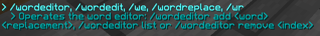

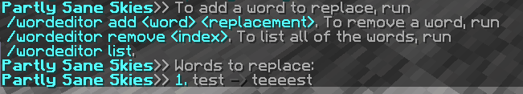


</details>

<details>
  <summary> 💀 Dungeons Features </summary>

## 💀 Dungeon Features

### Party Manager

Manage your party and join dungeons with a helpful party manager, with features such as viewing stats,
kicking, party transfer buttons, etc. Included in the Party Manager GUI.
You can open it by typing the command ``/pm`` or by using the keybinding.
Default: ``M``

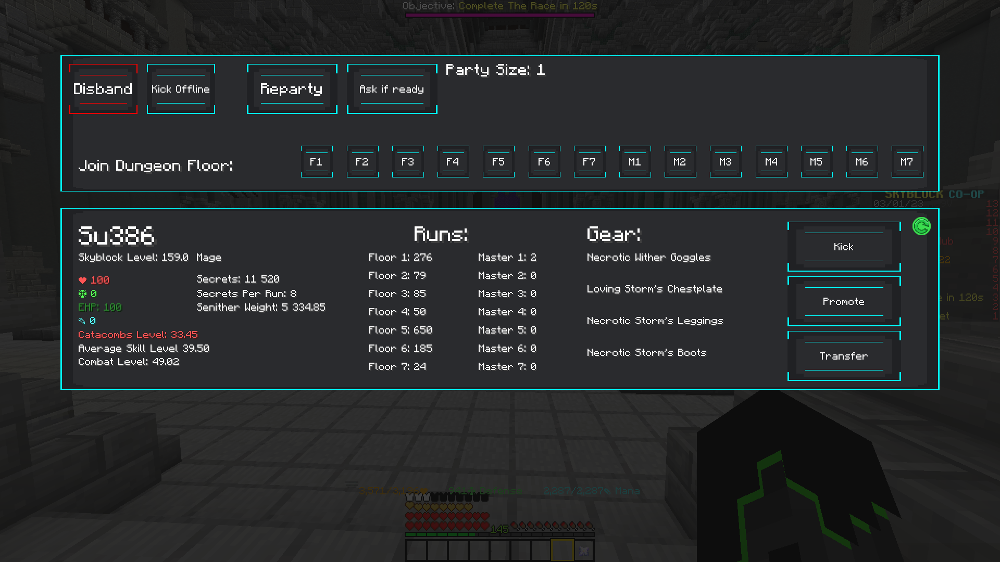 

### Custom Themes

This mod supports a variety of different themes, including dark themes, very dark themes, colorful themes, and controversially, light themes. You can also choose your own accent color, and create your own themes in the OneConfig menu under the theme section. These themes only affect the PSS user interface.

### Pearl Refill

Do you use pearls for your Dungeon runs and want to refill them backup to 16? With the Pearl Refill command you can automatically refill it back up to 16 from any other stack size, there is also a hot key (Default ``P``) and an option to enable auto refill at Dungeon start (use at your own risk)


### Watcher Ready, Message, Warning, Siren and Sound

When the watcher is done spawning mobs, a message will appear on your screen, along with an optional sound,
party message and World War II (1939–1945) air raid siren in case the previous two don't get your attention.

### Permanent Dungeon Party Selector

Automatically parties everyone in a permanent dungeon party. Using ``/pp`` or ``/permparty``, you have the option to create, party, delete, and add and remove members from your permanent party. You can even add different parties such as an f6Party or a jujuNonCarry party.


### Dungeon Player Rater

At the end of the dungeon, the mod will calculate what percentage of the dungeon was cleared by each player,
and how much they contributed, showing you how useful each player was.
In a perfectly balanced 5-player party, each player should get 20%.

### Required Secrets Notifier

Your teammates are throwing because they don't know you don't need 100% of secrets on lower floors? This feature sends a warning to yourself with a banner and sound (which can be an air raid siren) and a party message for your teammates when all the required secrets are found for an S+ run. 

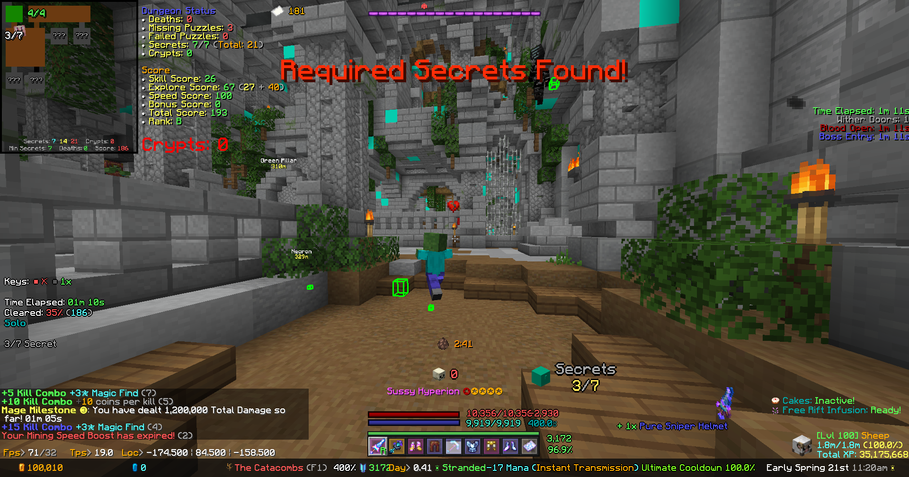
</details>

<details>
  <summary> 🌾Farming and Garden Features </summary>

## 🌾 Farming

### End of Farm Notifier

Create a region where you will be notified when you reach it, using the same commands as world edit. See ``/farmnotif`` under the Commands section for more information.

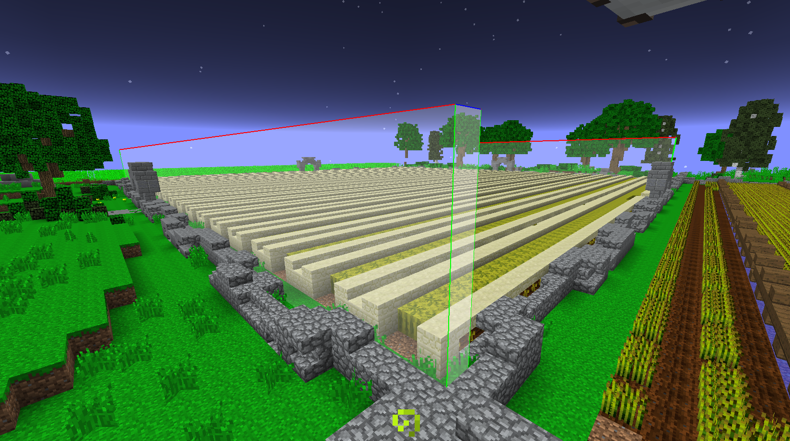 

### Top Crops to Compost

Shows you information about which crops are the best to use for the composter at the current moment in time.

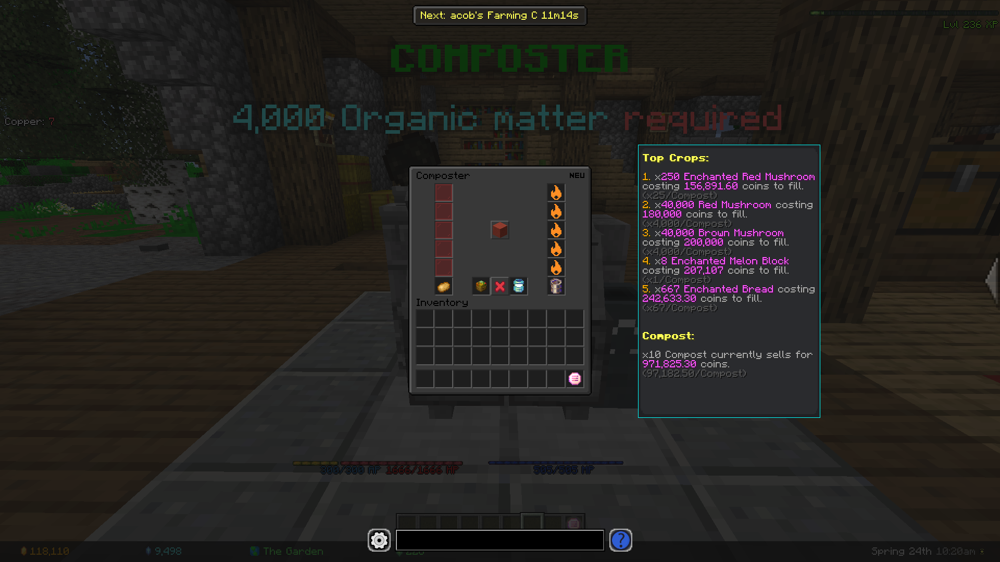 


### Best SkyMart Profit

Shows which items are the most profitable for the copper cost. (Which ones give the most coins per copper?)

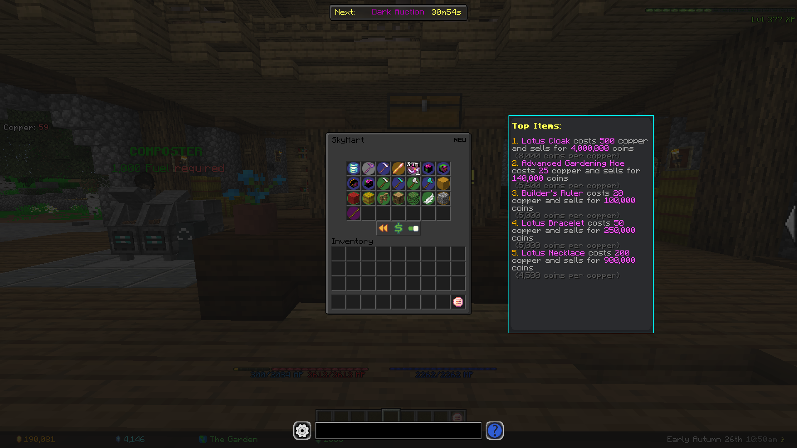
</details>

<details>
  <summary> ⛏️ Mining Features </summary>

## ⛏️ Mining Features

### Worm Warning

When you are mining in the Crystal Hollows and a worm or Scatha spawns, you get a message on screen, along with a sound, warning you that a worm has spawned.

### Mining Events Reminder

The mining events reminder has a selective list of all Dwarven mines & crystal hollows events. These events can be enabled separately. You can be reminded with either a banner or a banner and sound. You can choose the banner's color and display time yourself. You can also get reminded 20 seconds before the event starts.

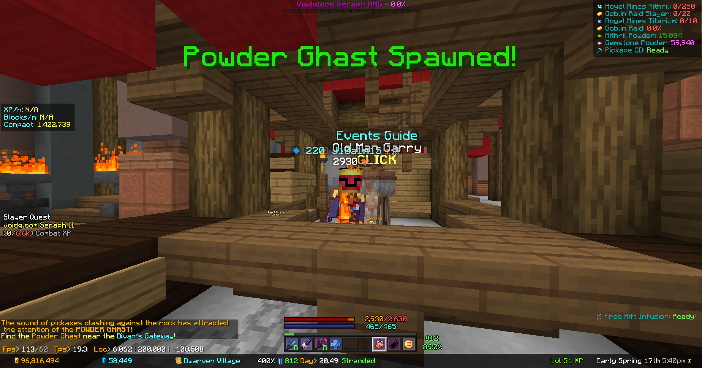 


### Pickaxe Ability Reminder

Not always aware when the pickaxe cooldown is over? Not anymore! With the new pickaxe cooldown reminder, this won't happen anymore. Need a banner? We have that! Want color in it? It's already available! Sound? Of course. It also includes PTSD, the best feature of it all—the Air Raid Siren! You can also block right-clicks on your private island, so you'll never accidentally pickoboculus your island again.

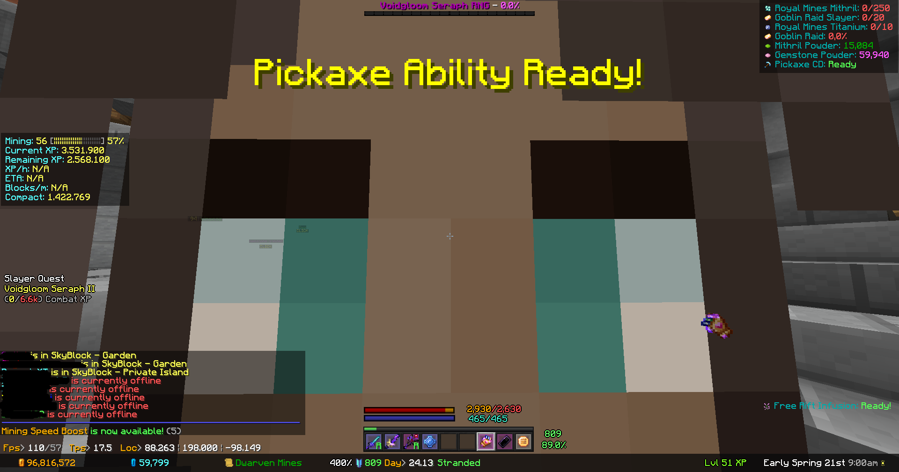
</details>

<details>
  <summary> 🪙 Economy Features </summary>

## 🪙 Economy

### No Cookie Warning

Never lose your coins to the void again! When the mod detects you do not have a cookie active, it will warn you to buy a new one. Optionally, it can warn you only if you have a lot of coins in your purse.

### Enhanced Auction Menu and BIN Sniper

A brand-new auction house menu that gives you more information on prices, instant inflation, and mark up.
Using that information, the menu highlights BIN items that are significantly below their value (Default: 13% below).

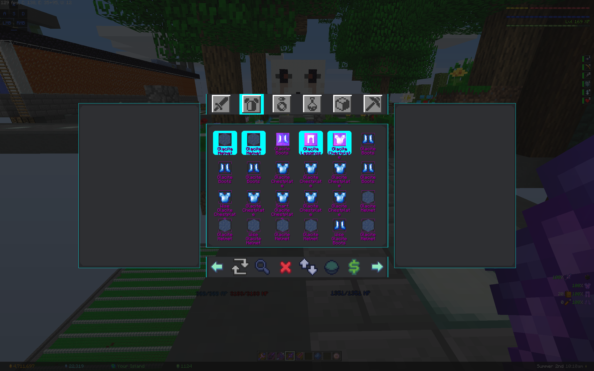 


### Best Minion Profit Calculator

Using real time data, the mod will now display which configurations will result in the most profitable minions. Type of Fuel, Minion Upgrades, and type of minion can be filtered.

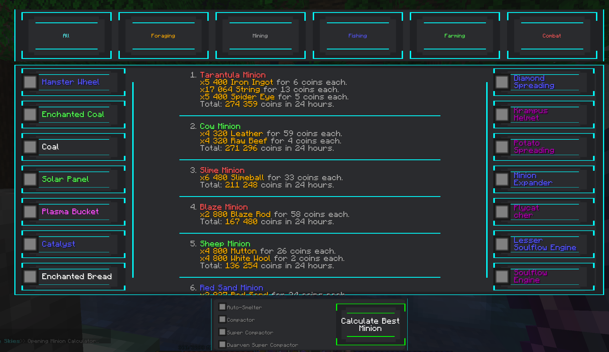 

### Best Bit Shop Profit

A lot of people use the bits accumulated from booster cookies to convert to items to sell on the auction house. Instead of having to guess which items are the best and for what price, it will now recommend to you the items that sell for the most coins per bit.

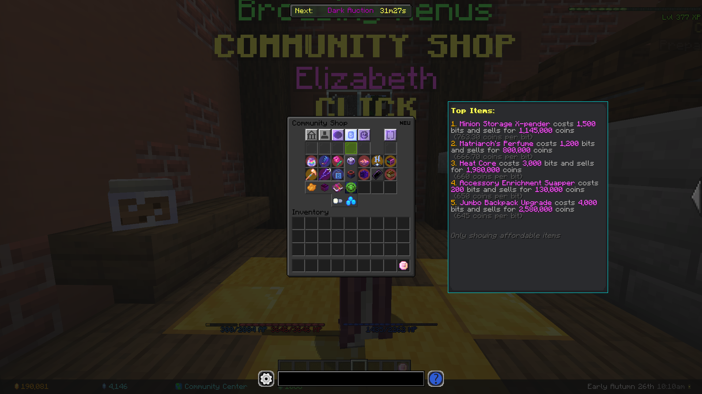
</details>

<details>
  <summary> ⌨️ Shortcuts </summary>

## ⌨️  Shortcuts

### Open Wiki Keybinding

Using the keybinding, it will automatically look up the wiki article for the item you are hovering over.
(``NONE`` key by default)

### Pets Menu Keybinding

A keybinding shortcut to open the pet menu. Customizable in the vanilla options' menu. (``NONE`` key by default)

### Crafting Table Menu Keybinding

A keybinding shortcut to open the crafting table menu.
Customizable in the vanilla options' menu.
(``NONE`` key by default)

### Wardrobe Menu Keybinding

A keybinding shortcut to open the wardrobe menu. Customizable in the vanilla options' menu. (``NONE`` key by default)

### Storage Menu Keybinding

A keybinding shortcut to open the storage menu. Customizable in the vanilla options' menu. (``NONE`` key by default)

### Hoe Right Click

A Keybinding shortcut to allow Hoe Right Click for one time or for some minutes, depending on your setting. Customizable in the vanilla options' menu. (``NONE`` by default)

### Party All Friends

A command to party all of your active friends. Using ``/fp``, it will party every online member on your friends' list.
</details>
